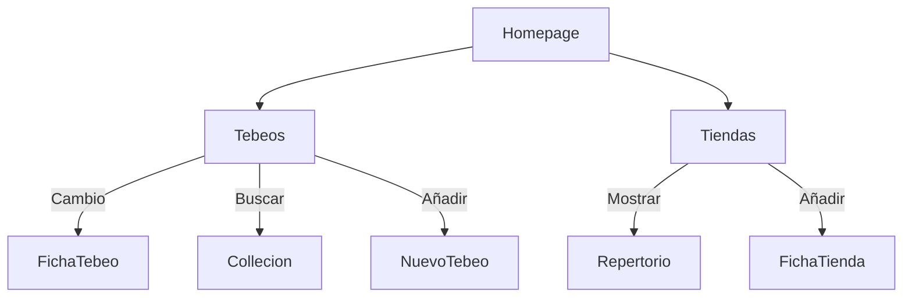
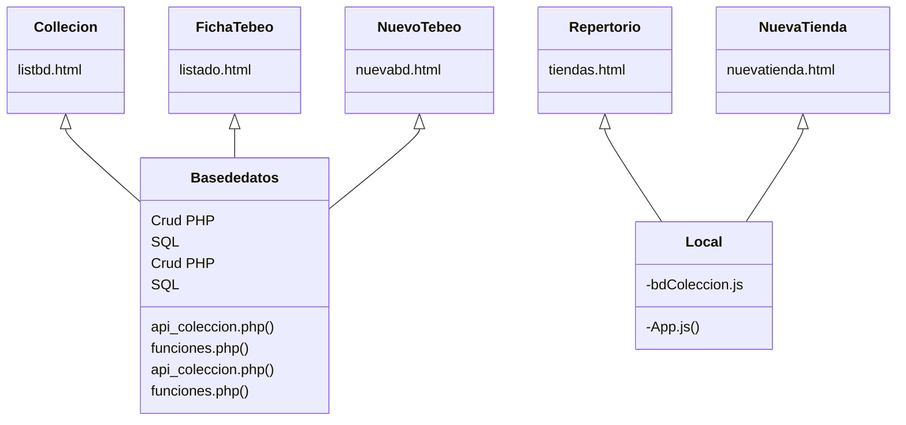
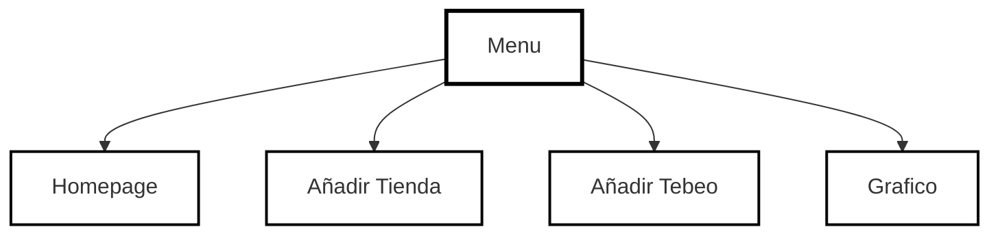

[BDtracker ([url](https://teeki.es/BD/))# PROYECTO FINAL 
**BDtracker** es una aplicación web (PWA) diseñada para una persona en concreto;para ayudarle a gestionar sus colección de bande dessinées (tebeos) y  repertorio de las tiendas de comics que encuentra durante sus viajes.

### <ins>Tecnologías Utilizadas</ins>

  **Tecnología de Cliente** (FrontEnd)
HTML   
CSS   
JS   
Pwa (manifest.json)

**Tecnología de Servidor** (Backend)  
PHP    
MySQL     
JSON      

### <ins>Diseño</ins>  
<ins>Diseño</ins>: moderno y simple. Inspirado en neo brutalismo.  
<ins>Iconografía</ins>: FontAwesome 7.0.1.  
<ins>Tipografía</ins>:League Spartan (vía Google Fonts). 

El diseño es "Old School" y minimalista. El enfoque prioriza la gestión de datos masivos sobre la ornamentación visual, alejándose deliberadamente de las tendencias de diseño efímeras y de efectos visuales complejos que puedan comprometer el rendimiento. El objetivo principal es garantizar la máxima rapidez y claridad en la consulta de información.
el diseño implementa una navegación por etiquetas y filtros. En lugar de una exploración aleatoria, la interfaz está diseñada para un usuario experto que busca precisión, permitiendo organizar y localizar registros mediante criterios específicos de forma inmediata.

<ins>Accesibilidad Semántica</ins>: Implementación de atributos aria-label en elementos interactivos.
<ins>Visualización de Estados</ins>: El sistema utiliza indicadores visuales (basados en el campo booleano tieneslu) para ofrecer un feedback inmediato sobre el estado de la colección. Mediante el uso de códigos de color, el usuario puede identificar de un vistazo las carencias y existencias en su inventario.

### <ins>Paginas esenciales para el frontend</ins>  

  La interfaz se organiza de forma jerárquica a partir de la página principal, que enlaza con dos secciones principales: Tebeos y Tiendas. Cada sección contiene las acciones disponibles para el usuario, como consultar listados, buscar información, añadir nuevos registros y acceder a fichas detalladas. Esta estructura facilita una navegación clara y separa las funciones según el tipo de contenido gestionado.

### <ins>Paginas para el Backend</ins>

Para el backend: una solución híbrida en la que cada tecnología se utiliza según las necesidades reales de cada parte del sistema.  
- La colección de tebeos se **gestiona principalmente con PHP y SQ**L, lo que permite realizar operaciones CRUD, mantener los datos de forma persistente y centralizar el acceso a la base de datos en el servidor.
- **La gestión local de las tiendas**, se resuelven en el lado cliente con **JavaScript**, al no requerir el mismo nivel de persistencia ni complejidad.
  

____

#### <ins>Menu acceso directo</ins>

Un menu para facilitar añadir nueva aquisición y nuevas tiendas, además acceder a graficos.

----
### <ins> Cómo instalar la pwa </ins>

<ins>en Android</ins>

- Abre en Chrome la web que quieras usar como PWA.

- Toca el menú de los tres puntos arriba a la derecha.

- Pulsa “Añadir a pantalla de inicio” o la opción de instalar si Chrome la muestra.

- Confirma con “Agregar” "Añadir" o “Instalar”.

  La app quedará en la pantalla de inicio.
  
<ins>en IOS </ins>

- Abre en Safari la web que quieras usar como PWA.

- Toca el botón de Compartir.

- Baja en el menú y pulsa “Añadir a pantalla de inicio”.

La app quedará en la pantalla de inicio.
