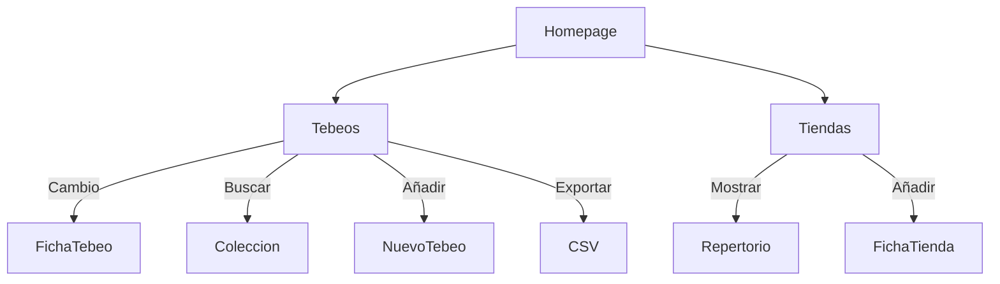
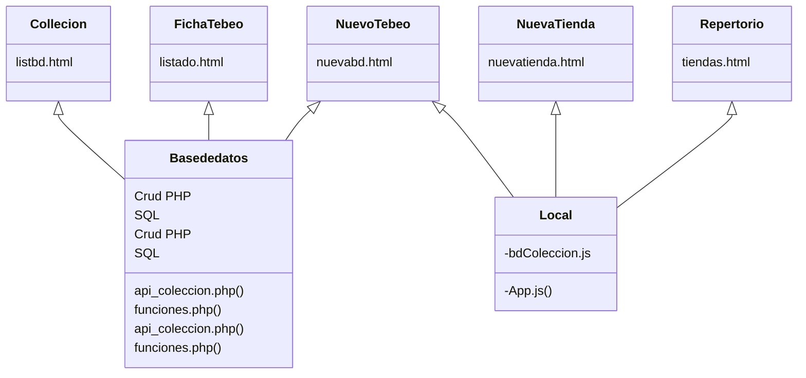
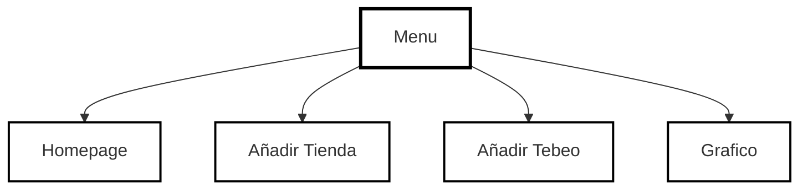

 # PROYECTO FINAL  
 [BDtracker ([url](https://teeki.es/BD/))  
 
**BDtracker** es una aplicación web (PWA) diseñada para un collecionista de tebeos ;para ayudarle a gestionar sus colecciones de bande dessinées (tebeos) y  repertorio de las tiendas de comics que encuentra durante sus viajes.


### <ins>Tecnologías Utilizadas</ins>


  **Tecnología de Cliente** (FrontEnd)
HTML   
CSS   
JS   
Pwa (manifest.json)


**Tecnología de Servidor** (Backend)  
PHP    
MySQL     
JSON      

### <ins>Diseño</ins>  
<ins>Diseños</ins>: Brutalismo Digital y Modern
<ins>Iconografía</ins>: FontAwesome 7.0.1.  
<ins>Tipografía</ins>:League Spartan (vía Google Fonts). 


<ins>Accesibilidad Semántica</ins>: Implementación de atributos aria-label en elementos interactivos.
<ins>Visualización de Estados</ins>: El sistema utiliza indicadores visuales (basados en el campo booleano tieneslu) para ofrecer un feedback inmediato sobre el estado de la colección. Mediante el uso de códigos de color, el usuario puede identificar de un vistazo las carencias y existencias en su inventario.


### <ins>Paginas esenciales para el frontend</ins>  

  La interfaz se organiza de forma jerárquica a partir de la página principal, que enlaza con dos secciones principales: Tebeos y Tiendas. Cada sección contiene las acciones disponibles para el usuario, como consultar listados, buscar información, añadir nuevos registros y acceder a fichas detalladas. Esta estructura facilita una navegación clara y separa las funciones según el tipo de contenido gestionado.

```mermaid
graph TD;
    Homepage --> Tebeos;
    Homepage --> Tiendas;

    Tebeos -->|Cambio| FichaTebeo;
    Tebeos -->|Buscar| Coleccion;
    Tebeos -->|Añadir| NuevoTebeo;
    Tebeos -->|Exportar| CSV;

    Tiendas -->|Mostrar| Repertorio;
    Tiendas -->|Añadir| FichaTienda;
```
### <ins>Paginas para el Backend</ins>

Para el backend: una solución híbrida en la que cada tecnología se utiliza según las necesidades reales de cada parte del sistema.  
- La colección de tebeos se **gestiona principalmente con PHP y SQ**L, lo que permite realizar operaciones CRUD, mantener los datos de forma persistente y centralizar el acceso a la base de datos en el servidor.
- **La gestión local de las tiendas**, se resuelven en el lado cliente con **JavaScript**, al no requerir el mismo nivel de persistencia ni complejidad.
  


```mermaid
classDiagram

    Collecion <|-- Base de datos
    Collecion : listbd.html
    FichaTebeo <|-- Base de datos
    FichaTebeo : listado.html
    NuevoTebeo <|-- Base de datos
    NuevoTebeo : nuevabd.html
class Base de datos{
      Crud PHP
      SQL
api_coleccion.php()
funciones.php()
     
    }
class Base de datos{
      Crud PHP
      SQL
api_coleccion.php()
funciones.php()
     
    }

   NuevoTebeo <|-- Local
    NuevoTebeo  : 
    NuevaTienda <|-- Local
    NuevaTienda : nuevatienda.html
 Repertorio <|-- Local
    Repertorio : tiendas.html
    
    class Local{
      -bdColeccion.js
      -App.js()
    }
  
```


Las informaciones (nueveo tebeo, nueva tienda)que añade el usuario se guardan en local.Los datos de los tebeos provienen de la base de datos (sql)

____


#### <ins>Menu acceso directo</ins>

Un menu para facilitar añadir nueva aquisición y nuevas tiendas, además acceder a graficos.


```mermaid
flowchart TD
    
    Menu --> D[Homepage]
    Menu --> E[Añadir Tienda]
    Menu --> F[Añadir Tebeo]
    Menu --> G[Grafico]

    %% 1. Definimos el estilo base para todos los nodos
    classDef base fill:#fff,stroke:#000,stroke-width:2px
    
    %% 2. Aplicamos la clase base a TODOS
    class Menu,D,E,F,G base

    %% 3. Ajustamos específicamente el Menu (esto sobrescribe el width de la clase)
    style Menu stroke-width:3px
```
----
#  Cómo usar

### Cambiar tema

1. En la página principal, localiza el selector visual de temas en la cabecera.
2. Pulsa **Brutalist** o **Modern** para cambiar el estilo de la aplicación.
3. El tema elegido se guarda automáticamente en el navegador.
4. Al volver a abrir la app, se mantiene el último tema seleccionado.

### Añadir un cómic

1. Navega a **Añadir BD** desde la página principal
2. Completa los campos: serie, título, autor y editorial
3. Selecciona el estado (Nuevu, Como nuevu, Bon estáu, Gastáu)
4. Marca si lo tienes en tu colección
5. Haz clic en "Guardar"

### Consultar la colección

1. En **Consultar BD** usa los filtros:
   - Busca por serie, título, autor o editorial
   - Filtra por serie específica
   - Filtra por estado de conservación
   - Muestra solo los que tienes o los que te faltan
2. Haz clic en una serie de los accesos rápidos o usa los filtros
3. Haz clic en **Buscar** para ver resultados

### Editar la colección

1. Ve a **Cambio** (página de edición)
2. Los cómics con fondo verde son los que tienes
3. Cambia el estado desde el selector
4. Haz clic en el botón para marcar si lo tienes o no

### Gestionar tiendas
1. **Para consultar tus tiendas**: clic el botón **Mostrar** en el inicio para ver la lista (tienes que haber grabado por loo menos una tienda)
1. **Añadir**: Ve a **Añadir Tienda** y completa el formulario

3. **Filtrar**: Filtra por país y ciudad. Obligatorio elegir si la tienda es online o fisica
4. **Editar/Borra las entradas**: En la página de tiendas puedes editar o eliminar

### Exportar datos

- En **Consultar BD** o **Tiendas**, usa el botón **Exportar** para descargar un CSV
- En la página principal, el botón **Exportar** bajo "Consultar BD" exporta la colección actual

## Exportación CSV

Los archivos CSV incluyen:

**Colección**: Título, Serie, Autor, Editorial, Estado, ¿Lo tienes?, Fecha de registro

**Tiendas**: Nombre, Tipo, Web, Dirección, País, Ciudad, Fecha de registro

Los archivos se descargan automáticamente con la fecha del día.

##  Estructura técnica

- **Frontend**: HTML, CSS, JavaScript vanilla
- **Almacenamiento**: LocalStorage (navegador)
- **PWA**: Service Worker para funcionamiento offline
- **Backend opcional**: PHP (crud)
- **Iconografía**: Font Awesome 7

### Archivos principales

```
public/
├── index.html              # Inicio
├── app.js                  # Lógica principal
├── csv-utils.js            # Exportación a CSV
├── style.css               # Estilos
├── bdColeccion.js          # Datos iniciales
├── sw.js                   # Service Worker
├── manifest.json           # Configuración PWA
├── crud/                   # Backend PHP
└── img/                    # Imágenes
```

##  Tebeos que viene por defecto

- Natacha
- Yoko Tsuno
- Blake & Mortimer
- Superlópez
- Blacksad
- Y cualquier otra serie que añadas

Cada serie tiene una imagen de portada. Las series no reconocidas muestran una imagen por defecto.

## Datos

- Los datos se guardan automáticamente en el navegador
- Se mantienen entre sesiones
- Se pueden exportar en cualquier momento
- Los datos están protegidos a nivel de navegador

## Estados de conservación

- **Nuevu**: En perfecto estado, sin usar
- **Como nuevu**: Prácticamente sin uso
- **Bon estáu**: En buen estado, con poco uso
- **Gastáu**: Con señales de uso

## Compatibilidad

- Navegadores modernos (Chrome, Firefox, Safari, Edge)
- Funciona en móvil y tablet
- Soporte PWA: instálable como app nativa

##  Atajos

- Desde la página principal, haz clic en el nombre de una serie para filtrar por ella
- Los filtros se guardan automáticamente al cambiar

##  Notas

- La aplicación usa almacenamiento local del navegador; los datos no se syncronizan entre dispositivos
- Es posible conectar una base de datos MySQL para sincronización
- El Service Worker cachea los recursos para funcionamiento offline
----
### <ins> Cómo instalar la pwa </ins>

<ins>en Android</ins>

- Abre en Chrome la web que quieras usar como PWA.

- Toca el menú de los tres puntos arriba a la derecha.

- Pulsa “Añadir a pantalla de inicio” o la opción de instalar si Chrome la muestra.

- Confirma con “Agregar” "Añadir" o “Instalar”.

  La app quedará en la pantalla de inicio.
  
<ins>en IOS </ins>

- Abre en Safari la web que quieras usar como PWA.

- Toca el botón de Compartir.

- Baja en el menú y pulsa “Añadir a pantalla de inicio”.

La app quedará en la pantalla de inicio.
